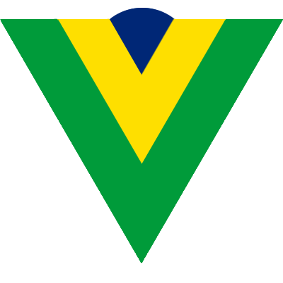

# Blog Vuejs-Brasil

  
Este é o site do Blog vuejs-brasil.com.br. Qualquer pessoa pode contribuir com o nosso Blog! É fácil, bastando apenas alguns conhecimentos sobre Git e Markdown. 

> Para saber mais sobre como criar um post para o nosso site, [clique aqui](http://vuejs-brasil.com.br/como-publicar-no-blog-vuejs-brasil/)

Logotipo By [@wilcorrea](https://twitter.com/@wilcorrea)

## Notas de migração

Esse Blog está sendo migrado para o jekyll. Algumas coisas ainda não funcionam! 

O que está faltando:

- [x] Comentários do disquss
- [ ] Importar as imagens de capa de artigo
- [x] Configurar os autores de cada artigo
- [ ] Configurar as tags e criar uma página de tags
- [ ] Criar no index.html uma forma de exibir os posts fixos

